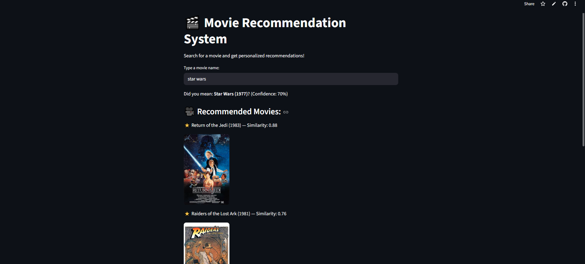

# 🎬 Movie Recommendation System 

This is a personalized movie recommendation system built with Python, Streamlit, and KNN.

## Features
- Fuzzy search (handles typos)
- KNN recommendations
- Similarity scores
- Movie posters via OMDb API
- Interactive Streamlit UI

## Demo
[Live Demo on Streamlit Cloud](https://movie-recommendation-system-bdyrucwj4sr5rmvdqewhgu.streamlit.app/)

## Installation
```bash
git clone https://github.com/berre6/https://github.com/berre6/movie-recommendation-system
cd https://github.com/berre6/movie-recommendation-system
pip install -r requirements.txt
streamlit run app.py


USAGE

1-Type a movie title (typos are fine)

2-Select the correct movie

3-See top 5 recommendations with posters


```markdown


